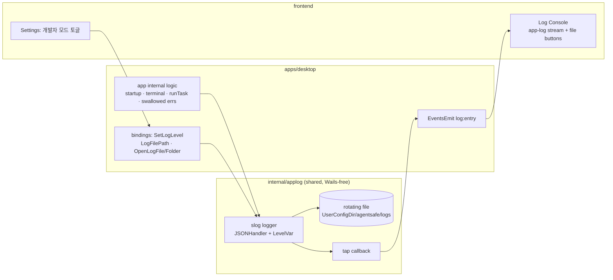

# feat: 데스크톱 앱 프로그램 로깅 + 개발자 모드

## Summary

agentsafe 데스크톱 앱(Wails)에 **자체 프로그램 로깅 체계**를 추가한다. 공유 패키지 `internal/applog`가 `log/slog` 기반으로 항상 ON baseline(info+error) JSON-lines 로그를 앱 레벨 파일에 기록하고, 런타임에 레벨(info↔debug)을 전환할 수 있게 한다. 데스크톱 바인딩은 각 로그 레코드를 Wails `log:entry` 이벤트로 흘려 **기존 Log Console**이 task 출력과 앱 내부 로그를 함께 라이브로 보여주게 하고, "로그 파일/폴더 열기"와 개발자 모드 토글을 제공한다. 민감정보는 **설계상(redaction by construction)** 기록하지 않는다.

신규 의존성은 없다(`log/slog`는 Go 1.25 표준). 항상 ON 파일 로깅·뷰어·개발자 모드는 **데스크톱 전용**이며, 이는 origin에 명시된 CLI/GUI 패리티 규칙의 의도적 예외다.

---

## Problem Frame

현재 가시성 구조에 두 구멍이 있다 (origin §2):

1. **앱 자신의 로직에는 로그가 없다.** `internal/output`의 sink는 *task*(prepare/diff/sync/pull)의 CLI 텍스트만 Log Console로 흘린다. `apps/desktop/app.go`의 `startup()`, 워크스페이스 복원, 터미널 생명주기, 이벤트 발행, 다수의 삼켜진 `_ = ...` 에러는 흔적을 남기지 않는다. Go 코드에 구조적 로깅이 전무하다(검증: `slog`/`logrus`/`zap` 미사용).
2. **기록이 휘발성이다.** `apps/desktop/frontend/src/components/ui/log-console.tsx`는 메모리 전용(최대 200개)이라 재시작 시 사라지고 파일로 남지 않는다.

동기: (a) 조용히 실패하는 앱 내부 로직을 **사후**에 디버깅(→ baseline 로깅은 항상 ON), (b) 타인이 버그 보고 시 첨부할 안전한 로그 파일(→ secret 미기록).

---

## Requirements

origin의 기능 요구사항(F1–F5)과 성공 기준(SC1–SC5)을 그대로 계승한다.

| ID | 요구사항 | origin | Units |
|----|----------|--------|-------|
| R1 | 항상 ON baseline(info+error) 파일 로깅, 시작 시점부터(워크스페이스 열기 전 포함) | F1 / SC1·SC4 | U1, U2, U3 |
| R2 | 개발자 모드 = 런타임 debug 상세도 + 뷰어 진입점, 앱 레벨 영구 설정, 재시작 없이 즉시 반영 | F2 / SC2 | U2, U5 |
| R3 | 기존 Log Console 확장: task + 앱 내부 로그 라이브 통합 | F3 / SC1 | U2, U4 |
| R4 | 영구 로그 파일 접근("열기"/"폴더 열기"), 앱 레벨 단일 위치 | F4 / SC3 | U2, U4 |
| R5 | 안전 필드만 기록; secret·토큰·자격증명·파일 내용 미기록 | F5 / SC5 | U1, U3 |

성공 기준(검증은 Verification 참고): SC1 라이브+파일 동시 기록, SC2 재시작 없는 debug 전환, SC3 폴더 열기, SC4 재시작 후 보존, SC5 로그에 secret 부재.

---

## Key Technical Decisions

- **KTD1 — `log/slog` + JSON-lines.** 표준 라이브러리만 사용(신규 의존성 0). `slog.JSONHandler`로 한 줄당 한 레코드를 쓴다. 근거: 라이브 콘솔에서 레벨/시각/소스 필드를 구조적으로 렌더링·필터링하기 쉽고, 향후 마스킹 적용 지점이 명확하다. 사람이 raw 파일을 읽는 경우는 앱 내 뷰어와 외부 에디터가 커버한다.
- **KTD2 — 코어 로거는 공유 `internal/applog`, Wails 비의존.** `internal/output.SetSink` 패턴을 그대로 따라 `SetTap(func(Entry))` 훅을 제공한다. 데스크톱이 tap에 Wails 이벤트 발행을 연결하므로 `internal/`은 Wails를 import하지 않는다. 근거: AGENTS.md 패리티·재사용 원칙.
- **KTD3 — 앱 레벨 파일 위치.** `os.UserConfigDir()/agentsafe/logs/agentsafe.log`. 근거(origin §8): 워크스페이스 열기 전부터 기록되어야 하고, 타인이 찾아 보내기 쉬운 단일 위치여야 한다. Windows에서는 `%AppData%\agentsafe\logs`.
- **KTD4 — 런타임 레벨 제어는 `slog.LevelVar`.** 개발자 모드 토글이 info↔debug를 즉시 바꾼다(재시작 불필요, R2). 에러는 레벨과 무관하게 항상 기록.
- **KTD5 — 크기 기반 단순 회전.** 파일이 상한(기본 ~5MB)을 넘으면 `agentsafe.log` → `agentsafe.log.1`로 1세대 회전. 소형 rotating `io.Writer`로 구현(신규 의존성 불필요).
- **KTD6 — 개발자 모드는 클라이언트 영구 설정 + 백엔드 호출.** 토글 상태는 `localStorage("agentsafe.devMode")`에 저장(기존 `agentsafe.terminalProgram`·테마 패턴과 동일), 변경/부팅 시 `App.SetLogLevel`을 호출해 백엔드 레벨에 반영.
- **KTD7 — Redaction by construction.** `applog` 헬퍼는 작업명·repo/feature·경로·소요시간·에러 메시지 같은 안전 필드만 받는다. 파일 내용·토큰·자격증명을 받는 API를 만들지 않는다. 자격증명은 이미 메모리 전용(`apps/desktop/app.go`의 `credentials` 맵).

---

## High-Level Technical Design

로깅 데이터 흐름: 코어 로거가 파일과 tap으로 갈라지고, 데스크톱이 tap을 Wails 이벤트로, 프론트가 이를 콘솔로 받는다. 바인딩과 설정 토글이 레벨을 제어한다.

방향성 안내이며 구현 명세가 아니다. 핵심: 파일 기록은 `main.go` 초기화 시점부터(ctx 이전) 동작하고, Wails tap은 `startup()`에서 ctx 확보 후 부착된다 — ctx 이전 레코드는 파일에는 남지만 라이브 콘솔에는 안 보인다(Risks 참고).

---

## Implementation Units

### U1. `internal/applog` 코어 로깅 패키지 (신규)

- **Goal:** slog 기반 파일 로거 + 런타임 레벨 전환 + tap 훅 + 크기 회전 + 안전 필드 헬퍼 + 경로 헬퍼를 제공하는 Wails 비의존 공유 패키지.
- **Requirements:** R1, R5 (KTD1·2·3·4·5·7)
- **Dependencies:** 없음
- **Files:**
  - `internal/applog/applog.go` (로거·LevelVar·SetTap·경로·안전 필드 헬퍼)
  - `internal/applog/rotate.go` (크기 기반 rotating writer)
  - `internal/applog/applog_test.go`
- **Approach:** `slog.JSONHandler`를 rotating writer 위에 구성하고 `slog.LevelVar`로 레벨 보관. `Init(path)` / `LogDir()` / `LogFilePath()`(= `os.UserConfigDir()/agentsafe/logs/agentsafe.log`, 디렉터리 생성 포함). `SetLevel(level)`로 info↔debug 전환. `SetTap(func(Entry))`는 각 레코드를 안전 필드만 담은 `Entry`(time·level·source·msg·attrs)로 외부에 미러링 — `internal/output.SetSink`와 동형. 헬퍼는 안전 필드만 인자로 받고 secret 인자 API를 노출하지 않는다.
- **Patterns to follow:** `internal/output/output.go`의 `SetSink`/sink 미러링 구조, 패키지 레벨 상태 + setter 스타일.
- **Test scenarios:**
  - 레벨 전환: info에서 debug 레코드가 억제되고, `SetLevel(debug)` 후 동일 호출이 파일·tap에 나타난다. 에러는 두 레벨 모두에서 기록된다.
  - 회전: 누적 기록이 상한을 넘으면 기존 파일이 `*.1`로 이동하고 새 파일이 빈 상태로 시작하며, 직전 내용이 `.1`에 보존된다(SC4 기반).
  - tap: 등록된 tap이 각 레코드를 정확히 한 번 받고, `Entry`에 제공한 안전 필드만 들어 있다(예기치 않은 필드 없음).
  - 경로: `LogFilePath()`가 `agentsafe/logs/agentsafe.log`로 끝나고 디렉터리가 생성된다.
- **Verification:** `go test ./internal/applog/...` 통과; 위 4개 시나리오 녹색.

### U2. 데스크톱 로거 초기화 + Wails tap + 바인딩

- **Goal:** 앱 시작 시 applog를 파일 경로로 초기화하고, ctx 확보 후 tap을 Wails `log:entry` 이벤트로 연결하며, 레벨/파일 접근 바인딩을 노출한다.
- **Requirements:** R1, R2, R3, R4
- **Dependencies:** U1
- **Files:**
  - `apps/desktop/main.go` (초기화)
  - `apps/desktop/app.go` (tap 설치 + 신규 App 메서드)
- **Approach:** `main.go`에서 `wails.Run` 전에 `applog.Init(applog.LogFilePath())` 호출(파일 기록이 ctx 이전부터 동작). `startup()` 안에서 `a.ctx` 설정 직후 `applog.SetTap(func(e){ runtime.EventsEmit(a.ctx, "log:entry", e) })` 설치. 신규 메서드: `SetLogLevel(level string) error`(허용값 검증 후 `applog.SetLevel`), `LogFilePath() (string, error)`, `OpenLogFile() error`·`OpenLogFolder() error`(각각 `openOSPath`·`revealInFileManager` 재사용, `apps/desktop/app.go:2382`·`2395`). 메서드 추가 후 Wails 바인딩 재생성으로 `frontend/wailsjs/go/main`의 TS가 갱신된다.
- **Patterns to follow:** `runTask`의 `runtime.EventsEmit` + 이벤트 페이로드 맵 구조; `OpenWorktreeTemplateFolder`(`revealInFileManager` 사용)와 `OpenPath`(`openOSPath` 사용)의 바인딩 형태.
- **Test scenarios:**
  - `SetLogLevel`: `"debug"`/`"info"`는 applog 레벨을 바꾸고, 알 수 없는 값은 에러를 반환한다(레벨 헬퍼 단위 테스트).
  - `LogFilePath`는 비어 있지 않은 경로를 반환한다.
  - `OpenLogFile`/`OpenLogFolder`: 존재하는 로그 파일에 대해 헬퍼 호출이 에러 없이 끝난다(가능 범위에서; 실제 열림은 수동 검증).
  - 통합: tap 설치 후 임의 로그 1건이 `log:entry` 페이로드(time·level·msg)로 발행된다.
- **Verification:** `make build-cli`·`go vet ./...` 통과; 레벨 검증 단위 테스트 녹색; 데스크톱 빌드 후 임의 작업에서 `log:entry` 이벤트 수신(U4와 함께 수동 확인).

### U3. 앱 내부 로직 계측

- **Goal:** 현재 삼켜지는 `_ = err`와 주요 생명주기 지점을 applog 호출로 전환해 앱 내부 로직이 항상 기록되게 한다.
- **Requirements:** R1, R5
- **Dependencies:** U1, U2
- **Files:** `apps/desktop/app.go`
- **Approach:** 식별된 지점에 안전 필드 로그 추가 — `startup()`의 `registry.Load()`·`config.LoadFrom` 실패(warn), 워크스페이스 open/switch(info), 터미널 open/write-timeout/close(info·warn), `agent:exit`(info), `runTask`의 시작·종료·에러(라벨·소요시간; info, 에러는 error). 자격증명 관련 에러는 host 정도만 남기고 secret 값은 제외(R5). debug 레벨에서만 더 상세한 컨텍스트 추가. **app.go 광범위 리팩터는 범위 밖** — 로깅 계측만.
- **Patterns to follow:** 기존 `_ = registry.Add(...)` / `_ = config.LoadFrom(...)` 사이트(`startup()`); `runTask`의 라벨·err 처리.
- **Execution note:** 기존 동작을 바꾸지 말 것 — 로그만 추가하고 에러 전파/제어 흐름은 유지.
- **Test scenarios:**
  - 실패하는 task → `runTask` 경로가 라벨과 함께 error 레코드를 tap/파일로 낸다(SC1 기반).
  - 손상된 registry로 `startup()` → warn 레코드가 남고 앱은 계속 동작한다.
  - 터미널 write 타임아웃 경로 → 해당 사유가 로그에 남는다.
  - secret 부재: 자격증명/토큰을 쓰는 경로를 거친 뒤 로그 파일에 secret 값이 없다(SC5 — 수동 grep 검증, origin 성공 기준).
- **Verification:** 데스크톱 실행 후 SC1/SC5를 수동 확인; `go vet ./...` 통과.

### U4. Log Console 확장: 앱 로그 라이브 + 파일 버튼

- **Goal:** 기존 Log Console이 `log:entry`를 구독해 "앱 로그" 스트림을 라이브로 보여주고, "로그 파일 열기 / 폴더 열기" 버튼을 제공한다.
- **Requirements:** R3, R4
- **Dependencies:** U2 (`log:entry` 이벤트 + 파일 바인딩)
- **Files:**
  - `apps/desktop/frontend/src/components/ui/log-console.tsx`
  - `apps/desktop/frontend/src/i18n/translations.ts` (문자열 키)
  - `apps/desktop/frontend/src/lib/api.ts` (신규 바인딩 노출 필요 시)
- **Approach:** `LogConsoleProvider`에 `rt.EventsOn("log:entry", …)` 리스너를 추가해 앱 로그 항목을 누적(기존 `task:*` 스트림과 병렬). `LogConsoleWindow` 헤더에 `api.OpenLogFile`·`api.OpenLogFolder`를 호출하는 버튼 추가(기존 copy/clear 버튼 패턴 재사용). 앱 로그는 별도 섹션/탭 또는 합성 항목으로 표시.
- **Patterns to follow:** `log-console.tsx`의 기존 `EventsOn("task:start|log|end")` 구독·정리 로직, 헤더 버튼(clear/copy) 마크업, `MAX_ENTRIES` 캡 방식.
- **Test scenarios:** Test expectation: none — 리포지토리에 프런트엔드 테스트 하니스 없음(빌드는 `tsc && vite build`). SC1·SC3로 수동 검증: 실패 작업 시 "앱 로그"에 에러가 라이브로 보이고, "폴더 열기"로 로그 폴더가 열린다.
- **Verification:** `pnpm build`(`tsc && vite build`) 통과; 데스크톱에서 SC1·SC3 수동 확인.

### U5. 개발자 모드 토글 + 부팅 시 레벨 복원

- **Goal:** 설정 화면에 개발자 모드 토글을 추가하고(앱 레벨 영구), 토글·부팅 시 백엔드 로그 레벨을 반영한다.
- **Requirements:** R2
- **Dependencies:** U2 (`SetLogLevel` 바인딩)
- **Files:**
  - `apps/desktop/frontend/src/pages/SettingsPage.tsx` (개발자 모드 Card)
  - `apps/desktop/frontend/src/App.tsx` (부팅 시 저장된 레벨 push)
  - `apps/desktop/frontend/src/i18n/translations.ts` (문자열 키)
- **Approach:** `localStorage("agentsafe.devMode")`로 토글 상태 저장(기존 `agentsafe.terminalProgram` 패턴, `SettingsPage`의 `changeTerminalProgram` 형태). 토글 변경 시 `api.SetLogLevel(on ? "debug" : "info")` 호출 + `notify`. 앱 시작 시(`App.tsx`의 startup effect) 저장된 `devMode`를 읽어 레벨을 1회 push. 별도 디버그 UI는 최소화(origin §8).
- **Patterns to follow:** `SettingsPage.tsx`의 `terminalProgram` 로컬 상태/저장/`notify` 흐름, Card 레이아웃; `App.tsx`의 startup `useEffect`(`api.CurrentRoot` 호출부)와 `lib/theme.ts`의 localStorage 패턴.
- **Test scenarios:** Test expectation: none — 프런트엔드 테스트 하니스 없음. SC2로 수동 검증: 토글 ON 시 재시작 없이 이후 로그에 debug 상세가 추가되고, 재시작 후 토글 상태가 유지된다.
- **Verification:** `pnpm build` 통과; 데스크톱에서 SC2 수동 확인.

---

## Scope Boundaries

**이번 범위(In scope):** R1–R5 전부(항상 ON 파일 로깅, 개발자 모드, 뷰어 확장, 파일 접근, 안전 필드 로깅)와 그를 위한 앱 내부 로직 계측.

**Outside this product's identity (origin §3 비목표):**
- 앱 내 완전한 파일 뷰어(검색·레벨 필터·세션 탐색).
- 로그 경로의 홈/유저명 마스킹.
- 기존 mask 엔진(`internal/agent/security.go`)을 로그 라인에 적용.
- CLI의 파일 로깅 채택(`--log-file`).

**Deferred to Follow-Up Work (계획 중 인접 발견):**
- `internal/output`의 sink와 applog tap을 하나의 스트림으로 통합(현재는 task 스트림과 앱 로그 스트림을 병렬 유지).
- 로그 회전 세대 수·상한의 설정화(현재는 고정 기본값).

---

## Risks & Dependencies

- **ctx 이전 레코드는 라이브 콘솔에 안 보임.** `main.go` 초기화~`startup()` 사이 레코드는 파일에는 남지만 Wails tap 부착 전이라 콘솔에는 미표시. 디버깅 가치는 파일로 보존되므로 허용. (U2 설계에 반영)
- **Wails 바인딩 재생성 필요.** U2에서 App 메서드를 추가하면 `frontend/wailsjs/go/main` TS를 재생성해야 U4/U5가 타입을 본다. 빌드 흐름(`make build-desktop`/`wails`)에 포함.
- **프런트엔드 단위 테스트 부재.** U4·U5는 자동 테스트 하니스가 없어 origin 성공 기준 기반 수동 검증에 의존.
- **Windows 우선 타깃.** 파일 경로·열기 동작은 Windows에서 우선 확인(`%AppData%\agentsafe\logs`, `openOSPath`/`revealInFileManager`의 Windows 분기).

---

## Verification (origin 성공 기준 매핑)

- **SC1** 개발자 모드 OFF에서 실패 작업 → Log Console "앱 로그"에 에러 라이브 표시 + 파일 동일 기록 (U3·U4).
- **SC2** 개발자 모드 ON(재시작 없이) → 이후 로그에 debug 상세 추가 (U5·U2).
- **SC3** "폴더 열기" → 앱 레벨 로그 폴더 열림 (U4·U2).
- **SC4** 앱 재시작 → 직전 세션 로그가 파일에 보존 (U1 회전/영속).
- **SC5** 자격증명·토큰 경로 통과 후 로그 파일에 secret 값 부재 (U1·U3, 수동 grep).
- **자동:** `go test ./internal/applog/...`, `go vet ./...`, `make build-cli`, `pnpm build`.

---

## Sources & Research

- Origin: `docs/brainstorms/2026-06-24-desktop-logging-requirements.md` (요구사항·성공 기준·범위).
- 코드 참조: `internal/output/output.go`(sink 패턴), `apps/desktop/app.go`(`runTask`·`startup`·`revealInFileManager`@2382·`openOSPath`@2395), `apps/desktop/main.go`(앱 부트), `apps/desktop/frontend/src/components/ui/log-console.tsx`(이벤트 구독·뷰어), `apps/desktop/frontend/src/pages/SettingsPage.tsx`·`lib/theme.ts`(앱 레벨 설정 패턴), `apps/desktop/frontend/src/App.tsx`(startup effect).
- 기술 확인: `go.mod` Go 1.25 → `log/slog` 표준 사용(신규 의존성 0); Go 코드에 구조적 로깅 부재 확인.
- 외부 연구: 미실시 — 표준 라이브러리 + 강한 로컬 패턴(sink/이벤트/설정)으로 충분.
