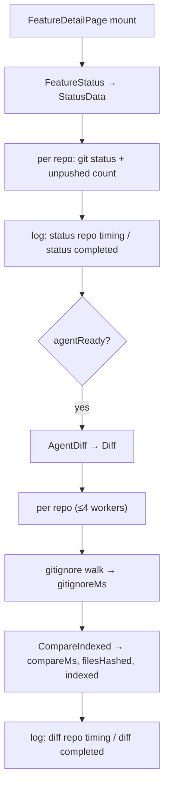

# perf: Instrument worktree-detail entry timing to locate the slow path

## Summary

Add per-phase timing to the worktree-detail entry path — the agent-workspace
status load and the change-diff load — written to the existing app log file, so
running the page and reading `agentsafe.log` pins down which phase causes the
~10s stall. This plan ends at cause identification; the actual speed fix is a
separate follow-up.

---

## Problem Frame

Opening a worktree detail page on small, early-stage workspaces (2–4 repos)
takes 10s+ before the change list appears. On entry the React page
(`apps/desktop/frontend/src/pages/FeatureDetailPage.tsx`) calls `FeatureStatus`,
then — once the agent workspace reports ready — calls `AgentDiff`; the two run
back-to-back, so perceived time is status load + diff load.

Static reading narrows the suspects but cannot explain 10s on a small tree:
status runs up to three local git subprocesses per repo sequentially
(`internal/feature/feature.go` `StatusData`), and diff walks each repo tree
twice — once in the `.gitignore`-honoring walk, once in the file scan
(`internal/agent/sync.go` `Diff`). The `.gitignore` walk is the most recently
added comparison feature and the user's regression suspect, but a stale prepared
file index forcing whole-tree content hashing is an equally plausible 10s cause.
Only a timed run distinguishes them, so the first step is measurement, not a fix.

---

## Requirements

### Observability

- R1. The status load and the diff load each emit a total duration to the app
  log file on every worktree-detail entry.
- R2. The diff load emits a per-repository phase breakdown — `.gitignore` walk
  time vs. compare/scan time — sufficient to attribute the dominant cost.
- R3. The compare phase reports whether the prepared file index was used and how
  many files required content hashing, so the indexed fast-path is
  distinguishable from the whole-tree hashing fallback.
- R4. Timings are written at a level readable without enabling developer mode.

### Correctness

- R5. Instrumentation is behavior-preserving: `StatusData` and `Diff` return
  identical results to before, and concurrent diff workers write log lines
  without corruption or interleaving.

---

## Key Technical Decisions

- Reuse the existing `applog` file logger (`internal/applog`) rather than ad-hoc
  prints: timings land in the same `agentsafe.log` the user already opens via the
  Log Console, and the format is structured JSON the existing tap can mirror.
- Instrument inside the core `internal/feature` and `internal/agent` packages,
  not the `apps/desktop` bindings: timing wraps the real work (git calls, tree
  walks, hashing) rather than the Wails round-trip, and the CLI path is measured
  too. `applog` no-ops until `Init`, so the CLI (which does not init it) is
  unaffected.
- Diff timing is per-phase (`.gitignore` walk isolated from compare) because the
  suspected regression is the `.gitignore`-honoring walk; isolating it
  confirms or refutes that hypothesis in one run.
- Emit one line per repo plus one completed-total line per operation.
  Concurrency safety comes from `applog`'s rotating writer, which serializes each
  whole-line `Write` under a mutex — workers cannot interleave.
- Log at **Info**, not Debug (confirmed with the user): measurement needs no
  developer-mode toggle. Accept mild steady-state noise; revisit the level when
  the fix lands (see Deferred).

---

## High-Level Technical Design

Entry path and where each timing field is captured:

The two `log:` stages are the measurement surface. `status completed` vs.
`diff completed` totals answer status-vs-diff; within diff, `gitignoreMs` vs.
`compareMs` answers walk-vs-compare; `indexed` + `filesHashed` answer
fast-path-vs-hashing-fallback.

---

## Implementation Units

### U1. Status-path timing in StatusData

- **Goal:** Time the per-repo git work and the whole status load, emitting them
  to the app log.
- **Requirements:** R1, R4, R5
- **Dependencies:** none
- **Files:** `internal/feature/feature.go`
- **Approach:** Wrap `StatusFiles` and `unpushedCount` per repo, and the whole
  loop, with `time.Since` measurements; emit a `status repo timing` line per repo
  (`statusFilesMs`, `unpushedMs`, `changes`) and a `status completed` line
  (`repos`, `ms`) via `applog.Info`. Returned `FeatureStatusResult` is unchanged.
  This change is already present in the working tree (uncommitted); the unit
  captures its intent and the fields emitted so review and follow-up have the
  contract in writing.
- **Patterns to follow:** the `applog.Info(msg, "ms", durationMs, ...)` shape
  already used in `apps/desktop/app.go` `runTask`.
- **Test scenarios:** Test expectation: none — pure timing instrumentation with
  no change to returned status data. Verify existing `internal/feature` tests
  (`internal/feature/worktree_test.go`) still pass.
- **Verification:** Entering a worktree detail page produces one
  `status completed` line and one `status repo timing` line per repo in
  `agentsafe.log`; status output in the UI is unchanged.

### U2. Per-phase timing in Diff

- **Goal:** Attribute diff cost per repo across the `.gitignore` walk and the
  compare/scan, plus a whole-diff total.
- **Requirements:** R1, R2, R4, R5
- **Dependencies:** none
- **Files:** `internal/agent/sync.go`
- **Approach:** In the per-repo worker, time the `gitIgnoredPatterns` call
  (`gitignoreMs`, plus `gitignorePaths` = count returned) and the
  `CompareIndexed` call (`compareMs`); capture `indexed` from whether the
  prepared file index is non-empty; emit a `diff repo timing` line per repo and a
  `diff completed` line (`repos`, `ms`) via `applog.Info`. Diff results are
  unchanged. Already present in the working tree (uncommitted); this unit records
  the field contract.
- **Patterns to follow:** same `applog.Info` shape as U1; the existing worker
  loop and `firstErr` handling in `Diff`.
- **Test scenarios:** Test expectation: none — pure timing instrumentation; the
  returned change map is unchanged. Verify existing `internal/agent` diff tests
  (`internal/agent/diff_index_test.go`, `internal/agent/gitignore_test.go`) still
  pass.
- **Verification:** Entering a worktree detail page produces one `diff completed`
  line and one `diff repo timing` line per repo; with concurrent repos the log
  has no interleaved/garbled lines.

### U3. filesHashed counter in the compare phase

- **Goal:** Distinguish a genuinely large tree scan from the whole-tree hashing
  fallback by reporting how many files the compare actually content-hashed.
- **Requirements:** R3
- **Dependencies:** U2 (consumes the count in the `diff repo timing` line)
- **Files:** `internal/agent/diff.go`, `internal/agent/sync.go`,
  `internal/agent/diff_index_test.go`
- **Approach:** Have the compare path report a count of files for which a content
  hash was computed — both the whole-tree case (empty index → every scanned file
  hashed) and the per-file fallback (index present but a file's size/modtime no
  longer matches the snapshot). Surface the count back to `Diff` and add it to the
  `diff repo timing` line as `filesHashed`. Counting is observational only — it
  must not change which `Change` entries are produced. This is the one phase the
  landed U1/U2 instrumentation cannot yet see into, and it directly separates the
  two leading 10s hypotheses when `compareMs` dominates.
- **Patterns to follow:** the existing indexed-compare flow in
  `internal/agent/diff.go` (`compare` / `CompareIndexed`) and its tests in
  `internal/agent/diff_index_test.go`.
- **Test scenarios:**
  - Happy path (indexed fast-path): compare with a populated index whose size and
    modtime match both snapshots → `filesHashed == 0`, no content reads.
  - Hashing fallback (stale index): compare with an index present but one file's
    recorded modtime or size changed → that file is hashed → `filesHashed`
    counts exactly the mismatched files.
  - No-index path: compare with an empty index → `filesHashed` equals the number
    of scanned (non-ignored) files in both trees that get hashed during the walk.
  - Behavior preserved: for each of the above, the returned set of `Change`
    entries is identical to the pre-counter behavior (counter is side-effect-free).
- **Verification:** `go test ./internal/agent` passes including the new
  scenarios; a real run logs `filesHashed` alongside `compareMs`.

---

## Measurement & Cause Triage

The deliverable of this plan is a recorded measurement and an identified culprit,
not a fix. Procedure once U1–U3 are in:

1. Rebuild and run the desktop app (`make build-desktop`, or `make dev-desktop`
   which rebuilds the Go side on save).
2. Enter a slow worktree detail page (work tab) so `FeatureStatus` then
   `AgentDiff` run.
3. Open `agentsafe.log` — Log Console "open log file" button, or
   `%AppData%\agentsafe\logs\agentsafe.log` — and read the latest
   `status completed`, `diff completed`, and `diff repo timing` lines.

Triage:

| Reading | Indicated cause | Follow-up direction |
|---|---|---|
| `status completed` ms ≈ entry stall | Sequential per-repo git in status | Parallelize `StatusData` across repos |
| `diff completed` ms dominates, high `gitignoreMs` | `.gitignore` walk over-traversing | Scope the walk by the agent matcher / merge with scan |
| high `compareMs`, `filesHashed` ≈ all files | Stale/empty prepared index → whole-tree hashing | Fix prepare's FileIndex; avoid re-hashing |
| high `compareMs`, `filesHashed` ≈ 0 | Large tree enumeration | Reduce double-walk; bound traversal |

---

## Scope Boundaries

- In scope: timing instrumentation across the status and diff entry phases, and
  the measurement run that identifies the dominant cost.
- Out of scope: the performance fix itself.

### Deferred to Follow-Up Work

- The actual speed fix (status parallelization, diff double-walk elimination,
  hoisting per-repo-redundant security/template loading) — chosen after the
  measurement names the culprit.
- Converting the timing logs from Info to Debug/developer-mode-gated once the
  measurement phase is over, if the steady-state noise is unwanted.
- Frontend-side (React) entry timing, if the backend totals turn out not to
  explain the full perceived stall.

---

## Open Questions

- Deferred to implementation: whether the `filesHashed` count should also break
  out source-side vs. target-side hashes. Decide only if the first run shows the
  hashing fallback is the culprit and the split would change the fix.
