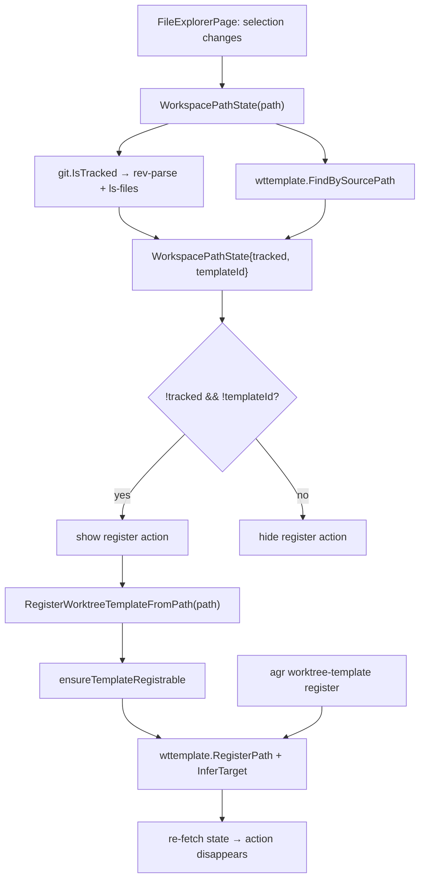

# feat: Register untracked explorer items as Worktree Templates

## Summary

Add a register action to the desktop File Explorer detail panel that turns the
selected file or folder into a Worktree Template, shown only when that item is
not tracked by git and is not already a template source. The tracked state is
resolved lazily per selection through a new Wails binding, and the underlying
registration capability lands in `internal/wttemplate` with a matching
`agr worktree-template register` command so CLI and GUI stay in parity.

---

## Problem Frame

Worktree Templates are the mechanism for carrying local-only files (editor
settings, agent instructions, scratch configs, `.env` samples) into new feature
worktrees and agent workspaces. Today the only way to register one is the
Worktree Templates page: a native file/folder picker
(`ImportWorktreeTemplateFiles`, `ImportWorktreeTemplateFolder`) or drag-and-drop
(`ImportWorktreeTemplatePaths`). The File Explorer already shows exactly those
files in place, and it already knows how to act on a selection — it can open,
edit, copy the path, delete, and overwrite an existing template from a file
(`OverwriteTemplateFromFile`) — but it cannot create a template.

The interesting candidates are precisely the items git does not track: files that
exist only in this workspace and therefore disappear from every new worktree.
Tracked files come back from the repository on their own and do not need a
template. So the affordance should key on tracked state, which the explorer
currently does not know at all — `internal/git` has no tracked-path helper
(`ls-files` and `check-ignore` appear nowhere in the repo), and
`WorkspaceTreeNode` carries no tracked field.

---

## Requirements

### Tracked-state detection

- R1. The detail panel resolves whether the selected file or folder is tracked by
  git for the selected item only, without adding git work to tree expansion.
- R2. A path that lies outside any git work tree resolves to untracked rather
  than to an error.
- R3. A folder resolves to tracked when at least one tracked file exists beneath
  it, since git tracks files and not folders.
- R4. Detection runs through `internal/git`, never through a direct `exec` of
  git.

### Registration from the explorer

- R5. The detail panel offers a register action only when the selected item is
  untracked and is not already registered as a Worktree Template source.
- R6. Registering copies the selected file or folder into the worktree-template
  store and creates an enabled Worktree Template whose name is the item's base
  name.
- R7. The new template's Template Destination mode is inferred from where the
  item sits in the workspace, and remains editable afterwards on the Worktree
  Templates page.
- R8. Registering a source path that is already registered fails with a message
  naming the existing template instead of creating a second entry.
- R9. The workspace root and any path inside `.agentsafe/` cannot be registered.
- R10. A successful registration reports success and refreshes the detail panel
  so the register action disappears without a manual reload.

### CLI parity and output

- R11. `agr worktree-template register PATH [PATH...]` registers the same way,
  accepting `--target`, `--repo`, `--overwrite`, and `--disabled` to override the
  inferred destination.
- R12. The register command emits both human text and structured output, and its
  structured output reports each path's tracked state.

### Localization

- R13. Every new UI string exists in both the English and Korean translation
  blocks.

---

## Key Technical Decisions

- Detect tracked state with `git rev-parse --is-inside-work-tree` followed by
  `git ls-files`, both via `internal/git.Run`. `rev-parse` is checked by exit
  status so the result does not depend on locale, and it converts "not a repo"
  into a plain untracked answer (R2). `ls-files` reads the index, so a file
  staged but never committed counts as tracked — that matches the user's mental
  model better than `ls-tree HEAD`.
- Pass `-z` and `--literal-pathspecs` to `ls-files`. `git.Output` trims
  surrounding whitespace but not NUL, so the caller splits on `"\x00"` and drops
  empty fields; `--literal-pathspecs` keeps a name containing `*`, `?`, or `[`
  from being read as a glob.
- Resolve tracked state lazily per selection through a new binding rather than
  adding a field to `WorkspaceTreeNode`. `treeNode` runs on every expand, and a
  repo-root expand would then list the whole index for a value only the detail
  panel reads.
- Return a small `WorkspacePathState` DTO carrying both `tracked` and
  `templateId` in one round trip, so the button's two hide conditions (R5) need
  one call. The template lookup is by source path — `workspaceTemplateMarks` maps
  template *destination* paths, so a freshly registered source gains no tree
  badge and the tree cannot answer "already registered".
- Add `wttemplate.RegisterPath` instead of reusing `ImportPaths`. `ImportPaths`
  has no duplicate guard and is the drag-and-drop entry point on the Worktree
  Templates page; adding a rejection there would change that page's behavior.
  `RegisterPath` delegates to the existing `ImportFiles`/`ImportFolder` copy
  logic so the store layout stays identical.
- Infer the destination with a pure path helper, `InferTarget`, that reads the
  workspace-relative prefix (`feature/<key>/<repo>`, `agent/<key>`, `main/<repo>`
  …) and validates repo names against the config. Keeping it string-based means
  `wttemplate` does not import `internal/feature`, and an unrecognized layout
  falls back to `workspaceRoot` rather than guessing.
- Guard the desktop entry point with `ensureTemplateRegistrable`, mirroring
  `ensureExplorerDeleteAllowed`, on top of the containment check `workspacePath`
  already performs via `fsutil.EnsureInside`.
- The CLI command does not refuse tracked paths. `add-file` and `add-folder`
  accept them today, and treating tracked-ness as a hard error would break a
  legitimate CLI use. The untracked condition is a UI affordance (R5); the CLI
  reports tracked state instead of enforcing it (R12).

---

## High-Level Technical Design

Selection in the explorer drives one lazy state fetch; the register action calls
back into the same core package the CLI uses.

---

## Implementation Units

### U1. Tracked-path check in `internal/git`

- **Goal:** Answer "is this path tracked by git?" for both files and folders,
  through the package that owns every git invocation.
- **Requirements:** R1, R2, R3, R4
- **Dependencies:** none
- **Files:** `internal/git/git.go`, `internal/git/tracked_test.go`
- **Approach:** Add `IsTracked(path string) (bool, error)`. Stat the path to
  learn file vs. folder. Choose the working directory — the folder itself for a
  folder, `filepath.Dir(path)` for a file — and first run
  `rev-parse --is-inside-work-tree` there; a non-zero exit means no work tree, so
  return `false, nil`. Then run `ls-files -z --literal-pathspecs --` with the
  base name as the pathspec for a file, or with no pathspec for a folder, and
  treat any non-empty entry as tracked. Split output on `"\x00"` and ignore empty
  fields. Compare the returned name to the requested base name
  case-insensitively on Windows. A missing path returns the stat error.
- **Patterns to follow:** the existing `run`/`Run`/`Output` helpers in
  `internal/git/git.go` (context timeout, `GIT_TERMINAL_PROMPT=0`, `hideWindow`);
  the exit-status-only style already used by other predicate helpers there.
- **Test scenarios:**
  - Tracked file: init a repo, commit `a.txt` → `IsTracked` is true.
  - Staged-only file: `git add b.txt` without committing → true.
  - Untracked file inside a repo: → false, no error.
  - Ignored file (listed in `.gitignore`): → false, no error.
  - Path outside any work tree (a bare temp dir): → false with a nil error.
  - Untracked folder containing only untracked files: → false.
  - Folder containing at least one tracked file: → true.
  - Folder whose only tracked file sits in a nested subfolder: → true.
  - File whose name contains glob characters (`weird[1].txt`), tracked and
    untracked variants: → matches its own state, proving literal pathspecs.
  - Missing path: → error.
- **Verification:** `go test ./internal/git -run TestIsTracked` passes on
  Windows; `go vet ./...` clean.

### U2. Registration and destination inference in `internal/wttemplate`

- **Goal:** Register one workspace path as a Worktree Template, refusing
  duplicates and picking a sensible Template Destination.
- **Requirements:** R6, R7, R8
- **Dependencies:** none
- **Files:** `internal/wttemplate/wttemplate.go`,
  `internal/wttemplate/register_test.go`
- **Approach:** Add three exported items. `FindBySourcePath(root, src string)
  (Template, bool, error)` loads the store and compares `SourcePath` against the
  cleaned absolute `src`, case-insensitively on Windows. `InferTarget(root, src
  string, repoNames []string) (string, []string)` splits the workspace-relative
  path and maps `feature/<key>/<repo>/…` to `TargetSelectedRepos` with that repo,
  `feature/<key>/<file>` to `TargetFeatureRoot`, the `agent/…` equivalents to
  `TargetAgentSelectedRepos`/`TargetAgentRoot`, `main/<repo>/…` to
  `TargetSelectedRepos`, and everything else — including an unknown repo segment
  or a path outside `root` — to `TargetWorkspaceRoot`. `RegisterPath(root, src
  string, opts RegisterOptions) (Template, error)` stats the source, rejects an
  already-registered source path with a message naming the existing template,
  delegates to `ImportFiles` or `ImportFolder`, then applies the resolved
  destination (and `Overwrite`/`Enabled`) through the existing `Update` and
  returns the stored template. `RegisterOptions` carries `TargetMode`,
  `RepoNames`, `Overwrite`, and `Enabled`, with an empty `TargetMode` meaning
  "infer". Leave `ImportPaths` untouched.
- **Patterns to follow:** `ImportFiles`/`ImportFolder`/`defaultTemplate` and the
  `load`/`save`/`Update` flow in `internal/wttemplate/wttemplate.go`; the
  `config` accessors already imported there for repo names.
- **Test scenarios:**
  - Register a file: the store gains one enabled template whose `SourcePath` is
    the absolute source and whose copied content lives under
    `.agentsafe/worktree-templates/files/<id>/<base>`.
  - Register a folder: the folder itself is copied under the template id and the
    template is stored once.
  - Duplicate source path: a second `RegisterPath` on the same path returns an
    error, and the store still holds exactly one template.
  - Duplicate detection ignores path spelling differences that resolve to the
    same file (trailing separator, mixed case on Windows).
  - Explicit `opts.TargetMode` plus `RepoNames` overrides inference and is
    persisted.
  - `opts.Enabled` false stores a disabled template.
  - `InferTarget` table: workspace-root file → `workspaceRoot`;
    `feature/<key>/<repo>/x` → `selectedRepos` + that repo;
    `feature/<key>/x` → `featureRoot`; `agent/<key>/<repo>/x` →
    `agentSelectedRepos` + that repo; `agent/<key>/x` → `agentRoot`;
    `main/<repo>/x` → `selectedRepos` + that repo; `feature/<key>/<unknown>/x`
    → `workspaceRoot`; a path outside the workspace → `workspaceRoot`.
  - `FindBySourcePath` returns false for an unregistered path and does not fail
    when the store file is absent.
- **Verification:** `go test ./internal/wttemplate` passes, including the
  pre-existing apply/import tests.

### U3. Desktop bindings for path state and registration

- **Goal:** Expose tracked-plus-template state and the register action to the
  React frontend, guarded against protected paths.
- **Requirements:** R1, R5, R9, R10
- **Dependencies:** U1, U2
- **Files:** `apps/desktop/app.go`
- **Approach:** Add a `WorkspacePathState` DTO with a `Tracked bool` field
  serialized as `tracked` and a `TemplateID string` field serialized as
  `templateId` (omitted when empty), plus `func (a *App) WorkspacePathState(path
  string) (WorkspacePathState, error)` that resolves the path with
  `workspacePath`, calls `git.IsTracked`, and
  fills `TemplateID` from `wttemplate.FindBySourcePath`. Add `func (a *App)
  RegisterWorktreeTemplateFromPath(path string) (wttemplate.Template, error)`
  that resolves through `workspacePath`, runs a new
  `ensureTemplateRegistrable(root, target)` guard rejecting the workspace root
  and anything at or inside `filepath.Join(root, config.DirName)`, then calls
  `wttemplate.RegisterPath` with an empty `TargetMode` so the destination is
  inferred.
- **Patterns to follow:** `OverwriteTemplateFromFile` for the
  `requireRoot` → `workspacePath` → core-call shape;
  `ensureExplorerDeleteAllowed` with its `sameAbsPath`/`pathContains` helpers for
  the guard.
- **Test scenarios:** Test expectation: none — `apps/desktop` has no test files
  and these methods are thin binding wrappers whose logic is covered by U1 and
  U2. Guard behavior is verified manually per the Verification note below.
- **Verification:** `go vet ./...` and `make build-cli` stay clean; in a running
  app, selecting the workspace root or a `.agentsafe/` entry surfaces the guard
  error instead of registering.

### U4. CLI `worktree-template register`

- **Goal:** Give the CLI the same registration capability, keeping CLI/GUI
  parity.
- **Requirements:** R11, R12
- **Dependencies:** U1, U2
- **Files:** `internal/app/app.go`
- **Approach:** Add a `register` subcommand to `worktreeTemplateCmd()` taking one
  or more paths. Reuse the group's `applyFlags` so `--target`, `--repo`,
  `--overwrite`, and `--disabled` are available, and treat an explicitly changed
  `--target` as an override of inference by checking
  `cmd.Flags().Changed("target")`; otherwise pass an empty `TargetMode` to
  `RegisterPath`. Resolve the root through `cwdConfig()` and each argument
  relative to the current directory. For each path, call `git.IsTracked` for
  reporting only, then `wttemplate.RegisterPath`. Emit per-path lines in text
  mode and, when `output.IsStructured()`, a payload per path with the template
  plus a `tracked` field via `output.Emit`.
- **Patterns to follow:** the existing `addFile`/`addFolder` subcommands and the
  `applyFlags`/`normalizeAdded` helpers in `worktreeTemplateCmd()`; any nearby
  command's `output.IsStructured()` branch.
- **Test scenarios:** Test expectation: none — `internal/app` has no command
  tests, and the command is a flag-parsing shell over U1 and U2.
- **Verification:** `make build-cli`, then in a scratch workspace
  `./agr worktree-template register <untracked-file>` adds one template that
  `./agr worktree-template list` shows; re-running the same command reports the
  duplicate error; `--output json` yields the template plus `tracked`.

### U5. File Explorer detail-panel register action

- **Goal:** Show a register action in the detail panel for untracked,
  not-yet-registered items and wire it to the new binding.
- **Requirements:** R5, R10, R13
- **Dependencies:** U3
- **Files:** `apps/desktop/frontend/src/lib/types.ts`,
  `apps/desktop/frontend/src/lib/api.ts`,
  `apps/desktop/frontend/src/i18n/translations.ts`,
  `apps/desktop/frontend/src/pages/FileExplorerPage.tsx`
- **Approach:** Add a `WorkspacePathState` interface to `types.ts`, import it in
  `api.ts`, and declare `WorkspacePathState(path: string)` and
  `RegisterWorktreeTemplateFromPath(path: string)` on `AppBindings`. In
  `FileExplorerPage.tsx` hold `selectedState` in local state, fetch it in an
  effect keyed on `selected?.path` with a cancellation token so a fast selection
  change cannot apply a stale response, and clear it while loading. Render a new
  outline button in the existing detail-panel action row — after the
  `explorer.overwriteTemplate` button and before `feature.copyPath` — only when
  the fetched state says untracked with no template id. The handler mirrors
  `overwriteTemplate`: confirm, call the binding, toast on success, then re-fetch
  the state and refresh the node via `api.WorkspaceTree` + `replaceNode`. Add
  `explorer.registerTemplate`, its confirm message, and
  `toast.templateRegistered` to both the English and Korean blocks. The generated
  Wails bindings under `apps/desktop/frontend/wailsjs` are untracked build
  output and need no edit.
- **Patterns to follow:** the `overwriteTemplate` handler and its conditional
  button (`explorer.overwriteTemplate`, `FileUp` icon) in
  `FileExplorerPage.tsx`; the `useI18n`/`useToast`/`useConfirm` usage already in
  the file; existing paired `explorer.*` / `toast.*` keys in
  `i18n/translations.ts`.
- **Test scenarios:** Test expectation: none — the frontend has no test harness;
  covered by the type check and the manual verification below.
- **Verification:** `pnpm build` (`tsc && vite build`) in
  `apps/desktop/frontend` passes. In a running app: selecting an untracked file
  shows the action and registering it makes the action disappear and the template
  appear on the Worktree Templates page; selecting a tracked file shows no
  action; selecting an already-registered source shows no action; switching
  selection rapidly never shows the action for the wrong item.

---

## Scope Boundaries

- In scope: tracked detection, one-path registration from the explorer detail
  panel, destination inference, the duplicate and protected-path guards, and the
  CLI register command.
- Out of scope: changing how the Worktree Templates page imports (picker and
  drag-and-drop keep using `ImportPaths` with no duplicate guard); adding a
  tracked-state badge to the explorer tree; multi-select registration from the
  explorer; unregistering from the explorer.

### Deferred to Follow-Up Work

- Registering a whole selection of items at once, if the single-item action turns
  out to be tedious in practice.
- Surfacing template-source markers in the tree (today `workspaceTemplateMarks`
  only marks Template-derived Items at their destinations).
- Adding a duplicate guard to `ImportPaths` so the Worktree Templates page
  behaves like `RegisterPath`.

---

## System-Wide Impact

- CLI/GUI parity: the new `internal/` capability lands in both
  `internal/app/app.go` and `apps/desktop/app.go`, per the repository's parity
  rule.
- Git invocation policy: `IsTracked` is the first `ls-files` use in the repo and
  must go through `internal/git.Run`, inheriting the context timeout
  (`AGENTSAFE_GIT_TIMEOUT_SECONDS`), `GIT_TERMINAL_PROMPT=0`, and the Windows
  `hideWindow` suppression so no console window flashes in the desktop app.
- Per-selection latency: the detail panel gains up to two short git subprocesses
  per selection. This stays off the tree-expansion path by design (see KTDs).

---

## Risks & Dependencies

- A folder check runs `ls-files` over the whole folder subtree; on a repo root
  with a very large index the call is proportionally slower. The check is
  per-selection and bounded by the existing git timeout, and `ls-files` reads the
  index rather than walking the tree.
- Windows path comparison is case-insensitive while the stored `SourcePath` keeps
  its original spelling; the duplicate check must normalize before comparing or a
  differently-cased path would register twice.
- Inference is a convenience, not a contract. A misjudged Template Destination is
  correctable on the Worktree Templates page, so inference errs toward
  `workspaceRoot` rather than guessing a repo.

---

## Domain Vocabulary Note

`CONTEXT.md` defines **Worktree Template**, **Template Destination**, and
**Template-derived Item** (which explicitly avoids "Registered item"). This plan
uses those terms and calls the newly named concept — the workspace path a
Worktree Template was created from — a **Template Source**, matching the existing
`Template.SourcePath` field. "Template Source" is absent from the glossary; it is
a candidate for `/domain-modeling` to add. No ADRs exist under `docs/adr/`, so
there are no ADR conflicts to surface.

---

## Sources / Research

- `internal/git/git.go` — `run`/`Run`/`Output` invocation contract; `Output`
  trims whitespace but not NUL. No tracked-path helper exists; `ls-files` and
  `check-ignore` appear nowhere in the repo.
- `internal/wttemplate/wttemplate.go` — `Template`, target-mode constants,
  `ImportFiles`, `ImportFolder`, `ImportPaths` (no duplicate guard),
  `defaultTemplate`, `load`/`save`/`Update`.
- `internal/app/app.go:393-545` — `worktreeTemplateCmd()` with `applyFlags`,
  `normalizeAdded`, and the existing `list`/`add-file`/`add-folder`/`delete`/
  `clear`/`apply` subcommands.
- `apps/desktop/app.go` — `OverwriteTemplateFromFile` (nearest precedent),
  `workspacePath` + `fsutil.EnsureInside`, `workspaceTemplateMarks` (maps
  destination paths only), `ensureExplorerDeleteAllowed`, `WorkspaceTreeNode`,
  `treeNode`.
- `apps/desktop/frontend/src/pages/FileExplorerPage.tsx` — detail-panel action
  row and the `overwriteTemplate` handler the new action mirrors.
- `CONTEXT.md` — domain glossary the plan's wording follows.
